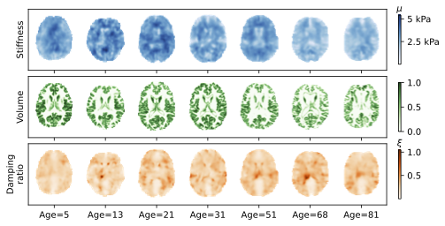
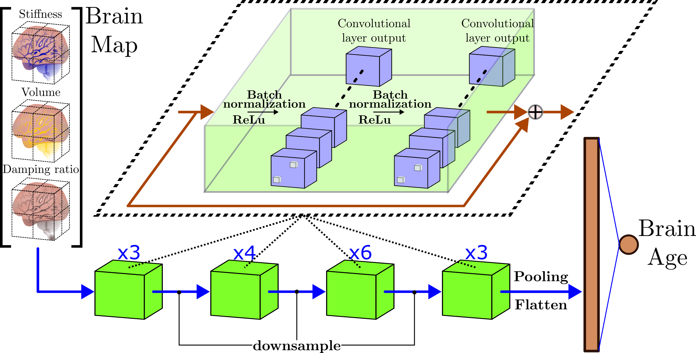
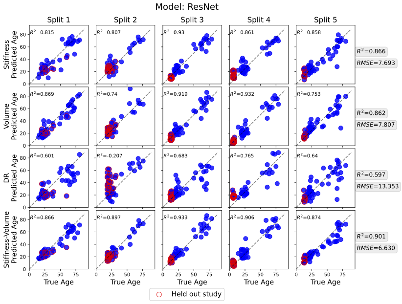
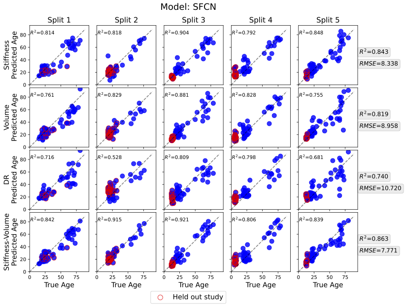
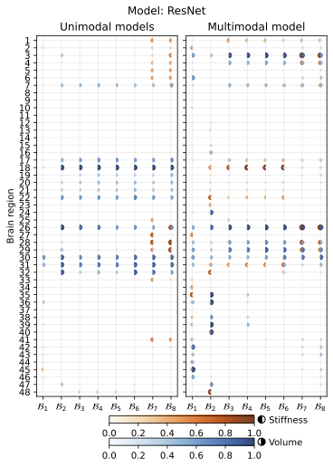
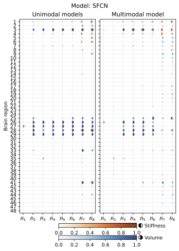

# MRI-based Whole-Brain Elastography and Volumetric Measurements to Predict Brain Age
Brain age, as a correlate of an individual’s chronological age from structural and functional neuroimaging data, enables assessing developmental or neurodegenerative pathology relative to the overall population. 
Accurately inferring brain age from brain magnetic resonance imaging (MRI) data requires imaging methods sensitive to tissue health and sophisticated statistical models sensitive to the underlying age-related brain changes. Magnetic resonance elastography (MRE) is a specialized MRI technique to non-invasively measure the brain's mechanical properties, such as the viscoelastic shear stiffness and damping ratio, that have been shown to change across the life span and reflect neurodegenerative diseases and individual differences in cognitive function. Using 3D convolutional networks as deep learning models, we relate age as a function of multiple modalities of whole-brain measurements: stiffness, damping ratio, and volume.

## MRI and MRE Measurements
Given that MRE is still an emerging neuroimaging technique and previously published sample sizes are relatively small, we pooled data from multiple studies employing similar imaging and processing protocols. We include data from healthy subjects of varying ages, including children, adolescents, young adults, and older adults. Stiffness [measurements](figs/raw_maps.png) (top) and volume [measurements](figs/raw_maps.png) (middle) show decreases in the older subjects .

## Model Architectures
We selected ResNet and SFCN as deep learning architectures as they show a strong performance when using voxel-based inputs. Specifically, we implemented the Resnet-34 [architecture](figs/resnet_model.png) with pre-activation Residual Units and a regression head. The SFCN was mostly implemented as described in the original protocol, modifying the last head for a regression head.

<!--  -->

## Model Predictions
Figures below show scatter plots of the true age ($x$-axis) versus brain age predictions ($y$-axis) for each subject in each one of the test sets for ResNet and SFCN trained models, respectively. When a prediction matches exactly the true age, it lies on the diagonal dashed line. Each row corresponds to a different kind of input, and each column is associated with the data set split used to train the models. $R^2$ scores are reported for each split and input. Additionally, the $R^2$ and RMSE scores for the predictions across all folds are reported for each input at the far right. Stiffness and volume as independent inputs show similar performance in terms of $R^2$ and RMSE. A multimodal input that combines stiffness and volume is the best performing model for both trained models.
ResNet             |  SFCN
:-------------------------:|:-------------------------:
  |  

## Model Interpretations through Spatial Salience Maps and Brain Region Associations
We computed saliency Regression Activation Maps (RAM) to compare and contrast the average saliency maps in different age across different inputs and architectures. Plot below shows axial views of averaged RAMs for different age bins using the trained multimodal ResNet model overlaid on slices of an MNI152 skullstripped T1 brain template with the front facing the right and superior slice (z=55) at the top and inferior (z=5) at the bottom. Each column corresponds to the averaged RAM for participants who belong to age bin $\mathcal{B}_t$. The last column shows the Spearman correlation of each voxel's salience to the chronological age.

Once the saliency are computed for each input, we used the Harvard-Oxford parcellation to identify relevant brain regions used by the models. Figure below shows parceled model saliency across bin ages. Overall, we observe that the strong saliency derived from the both stiffness and volume input maps overlap very little. The trained ResNet model displays a higher number of brain regions with strong saliency than the trained SFCN model.

ResNet             |  SFCN
:-------------------------:|:-------------------------:
  |  